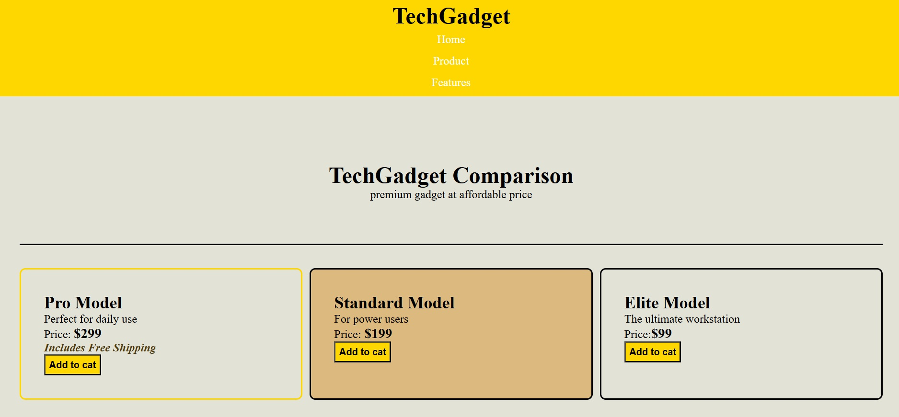

TechGadget Comparison
---
### 1. Project Brief

The **TechGadget Comparison** is a modern, responsive web application designed for tech enthusuasts. It provides a treamlined interface to compare high-end hardware to help users make informed purchasing decisions

### 2. Business Rationale

In a competitive content creation market, clarity and professionalism are key. This project addresses two primary business needs.

- Brand Authority: A clean semantic design establishes trust and positions the platform as the premium provider.

- Data Collection: The structured layout ensures that product details, pricing and key features are captured correctly.

### 3. Technologies used

- HTML5: Semantic structure for SEO and accessibility.
- CSS3: For responsive layout and modern styling (linked via `styles.css`).
- Git/Github: version control and feature-based branching.

### 4. Accessibility features

- Semantic HTML: Using header, main, section and article tags for screen readers.
- List structures: Key features are organized in `<ul>` and `<li>` tags, providing a clear reading path for assistive technologies.


### 5. Product features
The applicatin compares three primary tiers of technology.

**Pro Model**: For daily content creations, High performance daily drivers.
**Standard Model**: Power users, Balanced workstation power.
**Elite Model**: Ultimate enthusuasts, carbon fibre.


### 6. Git workflow


- **Fork the Repository:** Create your own copy of the project to work on.
- **Create a Feature Branch:** 

```bash
git checkout -b YourFeatureName
```

- **Commit Your Changes**
- **Push to branch:** 

```bash 
git push origin feature/YourFeatureName
```

- **Open a Pull Request(PR):** Describe your changesclearly and link the related issues.


### 7. Set up instructions

a. Clone this repository on your local machine.
```bash
git clone https://github.com/rollingsmajiwa/TECHGADGET_COMPARISSON.git
cd TECHGADGET_COMPARISSON.git
```

b. Ensure you have the media files.

c. Open 'index.html' in any browser.

### 8. Screenshots



### 9. Author
**Rollings Majiwa**

* GitHub: [https://https://github.com/rollingsmajiwa]
* Email: [rollingsmajiwa@gmail.com]

### Get started
Interested in the code behind TechGadget Comparison? You can reach me directly via my profile or open an issue for collaboration.
[**Visit my Github profile**](https://github.com/rollingsmajiwa)

